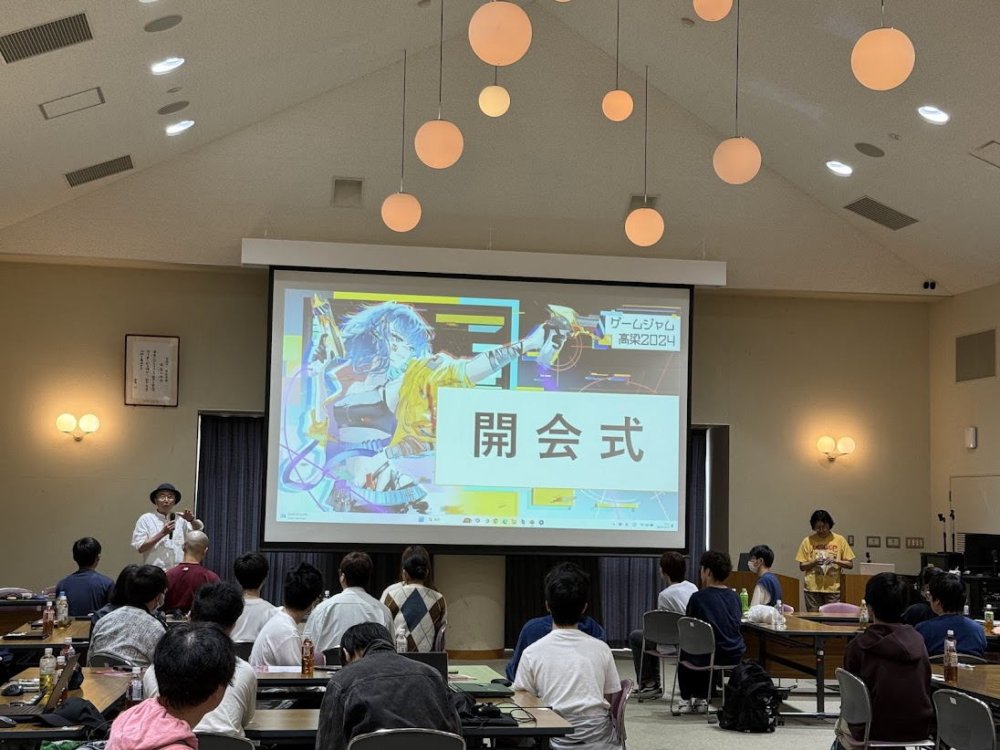
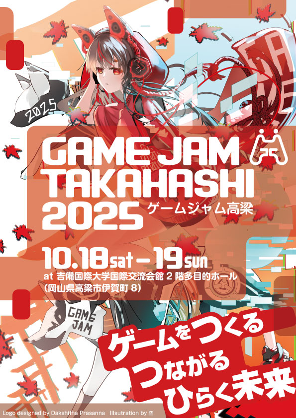
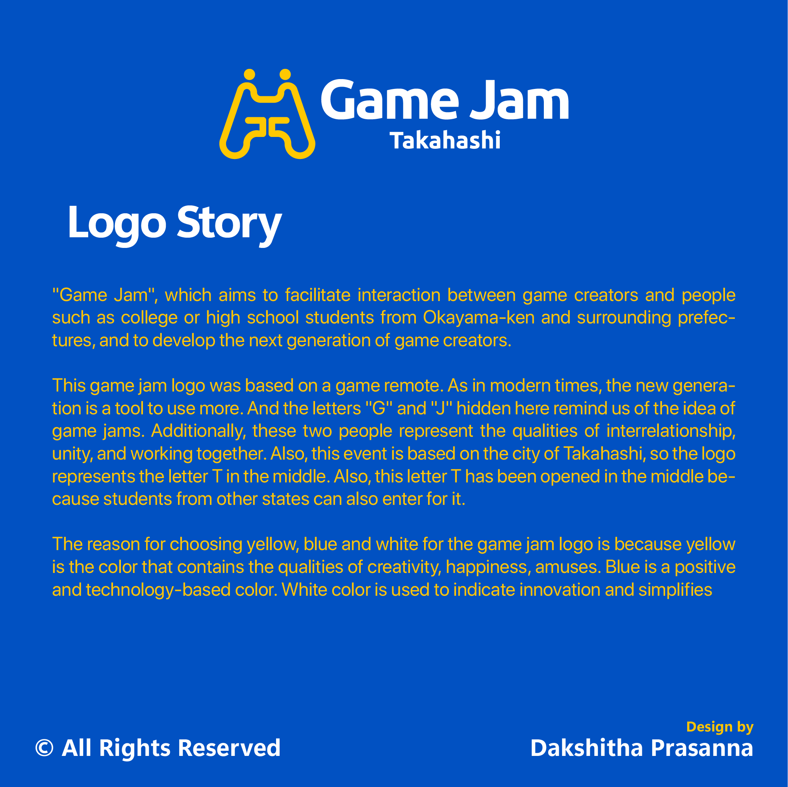

# ゲームジャム高梁2025開催します！

岡山県高梁（たかはし）市にて、即席チームが週末の二日間でゲームをつくるイベント **「ゲームジャム」** を中心としたイベントを今年も開催します！

これまでの開催レポートやニュース記事は以下の通りです。

- [若者がオリジナルゲームづくりに挑戦 高梁](https://www3.nhk.or.jp/lnews/okayama/20241019/4020021674.html) NHK Webニュース (2024年10月19日)
- [西日本豪雨で被害を受けた岡山県高梁市で 産官学連携によるゲームジャム高梁2018が開催](https://mediag.bunka.go.jp/article/article-14025/) 文化庁事業 メディア芸術カレントコンテンツ – 小野憲史 (2018年11月20日)
- [ゲームジャム高梁2022 ツイートまとめ](https://togetter.com/li/1961748) Togetter

**吉備国際大学アニメーション文化学科ブログ**

- [「ゲームジャム高梁2023」を開催しました！　そして、新たな告知！](https://www1.kiui.jp/pc/gakka/bunka/anime/blog/?p=5574) (2024年8月23日)
- [ゲームジャム高梁2022、3年ぶりにリアル会場でも開催でした！](https://www1.kiui.jp/pc/gakka/bunka/anime/blog/?p=5018) (2023年11月7日)
- [ゲームジャム高梁2018＆からくり装置作りワークショップの2日間！](https://www1.kiui.jp/pc/gakka/bunka/anime/blog/?p=2629) (2018年10月31日)

<a class="link-button" href="https://okauni.connpass.com/event/367034/">ゲームジャム参加登録はこちら</a>

## ゲームジャムとは？

**週末の限られた時間の中で、ゲームをゼロから1本作ります**。即席でチームを組み、役割分担はそれぞれの自己申告で決まります。初めて会う人達で多くの問題を解決し、エキサイティングなチーム開発が楽しめます！

チームで作品制作を行うのは会社では普通の事ですが、社会に出るまでは機会に恵まれないと体験できません。チーム開発をやった事が有ると無いでは大きな経験値の差が出ます。それを**短期間に体験できる非常に貴重なイベント**となってます！また、制作した作品はポートフォリオとして発表できますので、就活・転職にも活用できます。

初めて会う人達で多くの問題を解決し、エキサイティングなチーム開発が楽しめます！ 詳しくは以下の体験談をごらんください。

- [楽しくて病みつきになるゲームジャムのススメ 大前 弘樹](https://www.slideshare.net/pigeon6/ss-13910436)

## ゲームジャム高梁とは？

岡山県高梁市に集まった参加者が**即席のチーム**を作り、**30時間の制限時間内**に**決められたテーマ**のゲームを開発します。

昨今、地方創生・地域振興の一つの目玉として、ゲームやアニメなどのコンテンツ文化・コンテンツ産業が注目されています。中四国地方でも新しい分野で活躍できる人材の育成が進むとともに、従来の組織を超えた交流もはじまっています。

そこでゲームジャム高梁では、広域コミュニティの形成をめざして、岡山のゲーム開発者に限定せず県内外から他業種や学生の参加も歓迎します。

完成したゲームは [unityroom](https://unityroom.com/) や [itch.io](https://itch.io/) などで配信されます  
**[昨年開発されたゲームはこちらで配信中](https://unityroom.com/rankings/tags/8950)**

開発期間中に近隣住民の方々は本物のゲーム開発現場を解説を交えながら見学していただけます。

## 具体的にどんな事するの？前回の様子（２０２４年）

前回は、オンラインおよび対面会場で、総勢40名近い学生・社会人が市内外から集まり、大変盛況となりました！

## 参加するか迷っている方、まずは参加してみましょう！

毎年、 **「自分はプログラムとかできないので、参加してもできることがなさそう」「参加しても自分では役に立たないかもしれないので怖い」「出来る事が無いかもしれないので、参加するか迷っている」**  という方がいらっしゃいます。  
そういうときは、まずは参加してましょう！

ゲームジャム・ゲーム開発には、ゲーム企画、企画発表、素材制作、素材収集、プログラミング、レベルデザイン、プレイテスト、などなど、様々な役割がありますので、きっとあなたにしかできない事があります！

また、**ゲームジャムは失敗しても何のデメリットもありません。**  
失敗した、うまくいかなかった、としても、その経験値が得られ、次回に生かすことができます。

**＊学生、アマチュア、未経験者、大歓迎です。学びながら一緒に創作しましょう！**

## 何を勉強したらいいの？　→　事前勉強会に参加しよう！

**ゲームジャム高梁2025事前勉強会**

**初心者 or ゲームジャム初参加だけど何を勉強すれば良いのか…？**

そんな人に向けて、ゲームジャム高梁に事前勉強会を開催します。

**瀬戸内地方のゲーム制作コミュニティ**が一同に介して、 Unityの便利な機能や技術ノウハウ、ゲーム企画の制作を学べるセッションをお届けします。

もちろんゲームジャム高梁に参加しない方も大歓迎！ぜひお気軽にご参加ください。

<a class="link-button" href="https://hirouni.connpass.com/event/367035/">
事前勉強会の詳細・参加登録はこちら
</a>

# 参加条件

**ゲーム開発を始めた・始めたい方なら誰でも参加できます！**  
学生さんから現役の開発者の方、まったくプログラミングをやった事の無い初心者の方まで、興味のある方等、幅広い方々にご参加頂けます！  
経験0ヶ月の方も開発チームに参加できますので、参加するかどうか迷っている方はお問い合わせください。  
初心者歓迎ですが、開発に必要なソフトウェア類の操作、ならびにゲーム開発に関してある程度自習をお願いします。

## 賞一覧

- 方谷賞
- 高梁賞
- 讃岐GameN賞

## 審査員一覧

- 飯田史雄（吉備国際大学アニメーション学部教授）
- 松山恭大（吉備国際大学アニメーション文化学部准教授）
- 山根信二（安田女子大学）
- 渡辺 大（一般社団法人讃岐GameN　代表）

## 参加費

**イベント参加費は**  
**無料**  
**です！ぜひご参加ください！**

# スケジュール

## 10/04（土）

| 時間 | 予定 | 備考 |
|------|------|------|
| 13:00 | テーマ発表、ペラコン受付開始 | 事前勉強会にて |
| 17:00 | ペラコン受付開始をアナウンス。 | 岡山Unity勉強会のDiscordにて |

## 10/13（月）

| 時間 | 予定 | 備考 |
|------|------|------|
| 17:00 | イベント申込締切 | |

## 10/18（土）

| 時間 | 予定 | 備考 |
|------|------|------|
| 8:45 | 開場 | 吉備国際大学 国際交流会館2階ロビー |
| 9:00 | 受付開始 | グループ割り当て |
| 9:40 | 開会式 | |
| 9:50 | アイデア発表、チーム分け | |
| 10:15 | 制作開始 | (進行はチームごとに異なります) |
| 12:00 | 昼飯 | |
| 17:00 | 企画発表 | |

## 10/19（日）

| 時間 | 予定 | 備考 |
|------|------|------|
| 9:00 | 開場 | α版動作テスト、ベータ版開発 |
| 13:00 | 体験版テストプレイ | 来場者向けのテストプレイ開始 |
| 16:00 | リリース版アップロード | 30時間経過、完成版をリリース |
| 17:00 | 成果発表会 | |
| 17:00 | 試遊会 | |
| 17:45 | 各賞発表 | |
| 19:00 | 閉会式 | |

# 申込方法

ゲームジャム高梁への参加登録は下記コンパスからお申込みください。

<a class="link-button" href="https://okauni.connpass.com/event/367034/">
ゲームジャム参加登録はこちら
</a>

# お知らせ

**更新情報は随時Xからお知らせしますので、Xのフォローをお願いいたします！**

<a class="link-button" href="https://x.com/GJ__Takahashi">
            <svg xmlns="http://www.w3.org/2000/svg" width="30" height="30" viewBox="0 0 448 512" fill="white"><!--!Font Awesome Free v7.1.0 by @fontawesome - https://fontawesome.com License - https://fontawesome.com/license/free Copyright 2025 Fonticons, Inc.--><path d="M357.2 48L427.8 48 273.6 224.2 455 464 313 464 201.7 318.6 74.5 464 3.8 464 168.7 275.5-5.2 48 140.4 48 240.9 180.9 357.2 48zM332.4 421.8l39.1 0-252.4-333.8-42 0 255.3 333.8z"/></svg>
            @GJ__Takahashi
</a>

# アクセス

### 岡山県高梁市へ訪れるには

- [高梁市観光ガイド・交通アクセス](http://takahasikanko.or.jp/modules/takahashi/index.php?content_id=4)
- 電車の場合：JR岡山駅より伯備線（約35分～50分）でJR備中高梁駅下車。
- 車の場合：岡山空港から自動車で約40分。遠方の方は高速道路の周遊割引[「ぶらり中国ドライブパス」](https://www.michitabi.com/roundtour/chugokudrive/)も使えます。

### 国際交流会館までの道のり

- [吉備国際大学 国際交流会館アクセス](https://kiui.jp/outline/access/)
- 電車の場合: JR備中高梁駅から国際交流会館までは[循環バス(最寄り : 奥万田バス停)](http://www.bihokubus.com/time2.html)(170円)、または駅のタクシー乗り場からタクシー(およそ900円)をご利用ください。
- 車の場合：会場の国際交流会館には駐車場があります。大学キャンパス内の駐車場ではなく、国際交流会館前の駐車場を利用してください。

# これまでの歩み

高梁市役所で開催された第1回の[ゲームジャム高梁2015](https://okayamaunity.doorkeeper.jp/events/32270)は大きな注目を集めました。

その後も会場を吉備国際大学に移して、アニメーションシンポジウム・コスプレイベント・eスポーツ イベント・VTuberハッカソンと連携をひろげながら発展してきました。

- [人口3万2,000人の田舎町が「ゲームジャム高梁」を開催にこぎつけるまで](https://game.watch.impress.co.jp/docs/news/727626.html) GAME Watch (2015年10月)
- [「ゲームジャム高梁」を今年も開催](https://www1.kiui.jp/pc/gakka/bunka/anime/blog/?p=2597) 吉備国際大学アニメーション文化学科ブログ (2018年10月10日)

8年目となるゲームジャム高梁。創造力が掻き立てる興奮と協創に満ちた、ゲームジャムへの参加をお待ちしております！

# スペシャルサンクス

ゲームジャム高梁2025を彩る、デザイナーのお二方を紹介します！

- ゲームジャム高梁2025のイラストは空さんに描いていただきました。

- ゲームジャム高梁のロゴは [Dakshitha Prasanna](https://www.dakshithaprasanna.com/) さんに作成いただきました。

素敵な作品をありがとうございます！

# 協賛

<h2 class="silver-gradient">Silver Sponsor</h2>

 - [株式会社なのです](https://nanodes.jp/)

<h2 class="bronze-gradient">Bronze Sponsor</h2>

 - [株式会社ルークシステム](https://lukesys.co.jp/)
 - [燈屋](https://to-ya.org/)
 - [れもん@プチゲー屋](https://www.lemonte.net/)
 - [合同会社テゴ](https://te-go.co.jp/)
 - [株式会社共栄商事](https://kyoeigp.co.jp/)
 - [一般社団法人岡山県eスポーツ連合](https://okayama-e-sports.com/)
 - [ユニティ・テクノロジーズ・ジャパン株式会社](https://unity.com/ja)
 - [備北信用金庫](https://www.shinkin.co.jp/bihoku/)

## 個人協賛（掲載可の方）
ナカオクタカヒロ  
なっきー  
じむちょ@Roblox個人開発者

# ゲームジャム高梁の協賛のお願い

ゲームジャム高梁では協賛して頂ける方を随時募集しております。詳細は下記ページをご覧ください。

<a class="link-button" href="https://gjtakahashi.okayamaunity.com/sponsor/">
ゲームジャム高梁の協賛のお願い
</a>
